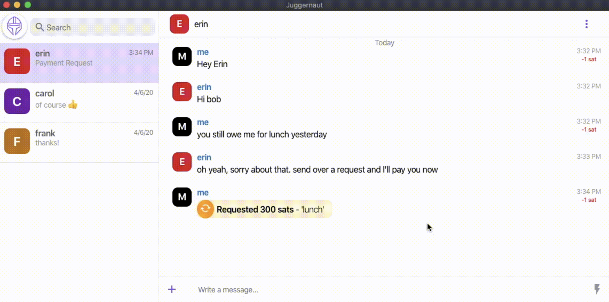

<!-- ALL-CONTRIBUTORS-BADGE:START - Do not remove or modify this section -->

<!-- ALL-CONTRIBUTORS-BADGE:END -->
 

**Juggernaut** utilizes the Lightning Network to provide end-to-end encrypted, onion-routed, censorship resistanst, peer-to-peer messaging with native payment capabilities.

 

## Install

Download the [latest release](https://github.com/LN-Juggernaut/juggernaut-desktop/releases) for your OS and follow the instructions below.

### macOS

Double click the .dmg file and then drag `Juggernaut.app` into your `Applications` folder.

### Windows

Just double click the .exe file to get started.

### Linux

You must first [make the file executable](https://docs.appimage.org/user-guide/run-appimages.html) and then double click or run via cli `./file.AppImage`

## Getting Help / Support

If you are having problems with Juggernaut, please report the issue on [Github](https://github.com/LN-Juggernaut/juggernaut-desktop/issues) or [telegram](https://t.me/beajuggernaut) with screenshots and how to reproduce the issue.

## Requirements

- LND 0.9.x (or greater) with KeySend Enabled

  ### How to enable Keysend

  On lnd.conf add :

  - accept-keysend=1

  Or run lnd with this argument:

  - --accept-keysend

  Keysend is currently an experimental feature. Your node will now accept payments from any node on the network without having to provide them with a n invoice first. _Note_: This is still an experimental feature so please be careful.

## Running From Source

- download the source `git clone git@github.com:LN-Juggernaut/juggernaut-desktop.git`
- navigate to project directory `cd juggernaut-desktop`
- install dependencies `yarn`
- start the project `yarn dev`

## Building From Source

You can run `yarn package` to build an executable that will be output in the `release` directory.

## Running more than one instance while testing

Currently the only way I've been able to do this for testing is to run one using `yarn dev` and the other using a built release from `yarn package`. If anyone knows how to run two separate instances of an electron app in development, please let me know!

## Maintainers

- [John Cantrell (@JohnCantrell97)](https://github.com/johncantrell97)

## License

MIT © [Juggernaut](https://github.com/LN-Juggernaut/juggernaut-desktop/LICENSE)

## Contributors ✨

Thanks goes to these wonderful people ([emoji key](https://allcontributors.org/docs/en/emoji-key)):

<!-- ALL-CONTRIBUTORS-LIST:START - Do not remove or modify this section -->
<!-- prettier-ignore-start -->
<!-- markdownlint-disable -->
<table>
  <tr>
    <td align="center"><a href="https://github.com/johncantrell97"> <b>John Cantrell</b></a> <a href="https://github.com/LN-Juggernaut/juggernaut-desktop/commits?author=johncantrell97" title="Code">💻</a></td>
    <td align="center"><a href="https://github.com/cpunk2140"> <b>Ștefan D. Mihăilă</b></a> <a href="https://github.com/LN-Juggernaut/juggernaut-desktop/commits?author=cpunk2140" title="Code">💻</a> <a href="#design-cpunk2140" title="Design">🎨</a></td>
  </tr>
</table>

<!-- markdownlint-enable -->
<!-- prettier-ignore-end -->
<!-- ALL-CONTRIBUTORS-LIST:END -->

This project follows the [all-contributors](https://github.com/all-contributors/all-contributors) specification. Contributions of any kind welcome!